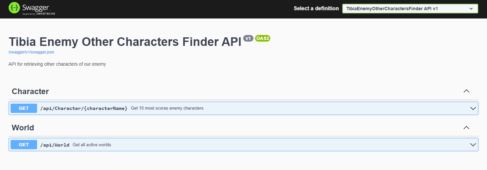
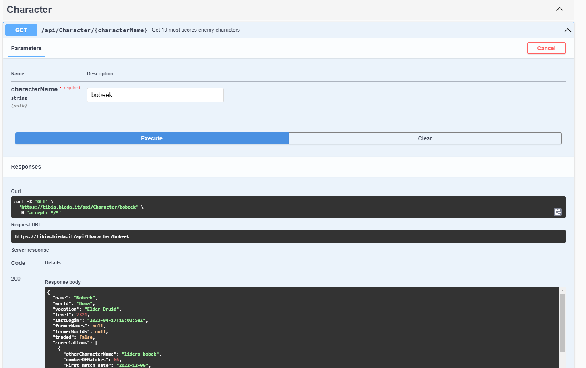
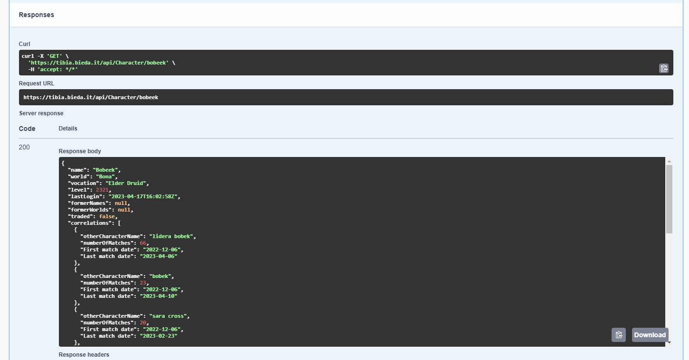

# _Tibia Stalker - API_

<table>
    <tr>
        <td>
            Tibia Stalker - API is an ASP.NET Web Api that helps players to detect other characters of their enemy.
        </td>
    </tr>
</table>

### Web Api
You can check out https://api.tibiastalker.pl/

---
## Table of Contents
* [General Info](#general-information)
* [Technologies Used](#technologies-used)
* [Features](#features)
* [Screenshots](#screenshots)
* [Setup](#setup)
* [Usage](#usage)
* [Docker Usage](#docker-usage)
* [Project Status](#project-status)
* [Room for Improvement](#room-for-improvement)
* [Contact](#contact)
* [License](#license)

---
## General Information
#### Dear Tibia Players ! 
- Have you ever been killed or cheated by some noob character, and you want revenge on his main character ? 

- Now it's possible! Application gives opportunity to find all characters of that player. Just type your suspect character name, and it gives you list of most possible other characters.

#### Important!
- You have to remember that application does not have 100% sure of other character match, it is only suggestion based on probability.
The more player plays, the more likely result will be close to true.


---
## Technologies Used
- ASP.NET Core 7.0
- C# 11.0
- EF Core 7.0
- Postgres - version 16
- RabbitMq
- SignalR
- TestContainers - documentation [_here_](https://github.com/testcontainers/testcontainers-dotnet)
- BenchmarkDotNet
- Dapper
- Moq
- Serilog
- Seq - documentation [_here_](https://docs.datalust.co/docs) , license [_here_](https://datalust.co/pricing)
- Swagger - documentation [_here_](https://swagger.io/docs/)
- Xunit
- MediatR
- FluentAssertions
- Autofac
- Docker
- Polly

---
## Features
**List the ready features here:**
- All data analyser mechanism with optimization data storage, also work if character changed name or was traded

**Endpoints:**
- GET`/health` - health check.
- GET`/api/tibia-stalker/v1/characters/{characterName}` - returns character details with 10 most scores possible other character names.
- GET`/api/tibia-stalker/v1/characters` (params `(string)searchText`,`(int)page`,`(int)pageSize`) - returns list of character names based on a fragment of the name, sorted in ascending order.
- GET`/api/tibia-stalker/v1/characters/prompt` (params `(string)searchText`,`(int)page`,`(int)pageSize`) - returns list of character names starts at fragment of the name, sorted in ascending order.
- GET`/api/tibia-stalker/v1/worlds` (params `(bool?)isAvailable`) - returns filtered worlds.
 
**Life Time Character Tracker:**

<i>Track your enemies whether is online or not.</i>

To track specific character use WebSockets to connect with:
```console 
{baseUrl}/connection-hub
```
Ones you connected send message:
```json
{
   "protocol":"json",
   "version":1
}
```
Now join to group to track enemy sending:
```json
{
   "arguments":[
      "your_enemy_character_name"
   ],
   "target":"JoinGroup",
   "type":1
}
```
To receive messages set "**_target:CharacterTracker_**":<br>
_Received message example:_
```json
{
  "type":1,
  "target":"Character Tracker",
  "arguments": [
    {
      "name":"bobeek",
      "isOnline":true,
      "hubEventId":"8bf7b7b9-77d6-41e7-8002-b30f8309718e",
      "occurredOn":"2024-07-15T12:59:42.7452908Z"
    }
  ]
}
```
To stop tracking one character just send message 
```json
{
   "arguments":[
      "your_enemy_character_name"
   ],
   "target":"LeaveGroup",
   "type":1
}
```
or disconnect connection to stop tracking all enemies.

Try with <u>Postman</u>. Example [_here_](https://www.rafaagahbichelab.dev/articles/signalr-dotnet-postman) <br>
_**Warning: Do not forget about special sign on the end!**_


---
## Screenshots

<h4 align="center">Swagger Api view</h>



<h4 align="center">Character Controller</h>

 

<h4 align="center">Example result</h>




---
## Setup

### Project require 
1. SDK version 7.0.x or higher ( instruction for Windows/Linux/macOS [_here_](https://dotnet.microsoft.com/en-us/download/dotnet/7.0) )
2. ASP.NET Core Runtime version 7.0.x or higher ( instruction for Windows/Linux/macOS [_here_](https://dotnet.microsoft.com/en-us/download/dotnet/7.0) )
3. Clone repository `git clone https://github.com/TibiaStalker/tibiastalker-api.git`
4. Seq environment on Windows [_here_](https://docs.datalust.co/docs/getting-started) or docker container [_here_](https://docs.datalust.co/docs/getting-started-with-docker)
5. Your own Postgres Database
6. RabbitMq environment or docker container
7. Create database in Postgres and configure `appsettings.json` or if you have Development environment copy `appsettings.Development-template.json` change file name to `appsettings.Development.json` and input your secrets
8. Configure `launchSettings.json`

---
## [Usage](https://github.com/kamiljanek/Tibia-EnemyOtherCharactersFinder)

1. Firstly you need to build project - go into repo directory, open CMD and type (`dotnet build`)
2. Than `dotnet publish -c Release -o /app`
3. Next you should firstly run `TibiaStalker.Api` to add all migrations - go into `./app`, open CMD and type `dotnet TibiaStalker.Api.dll`
4. Last step is to configure `cron` on your machine with periods as below:

- `WorldScanAnalyser` - (`dotnet WorldScanAnalyser.dll`) - ones per day
- `WorldScanSeeder` - (`dotnet WorldScanSeeder.dll`) - minimum ones per 5 min
- `DbCleaner` - (`dotnet DbCleaner.dll`) - ones per day/week
- `WorldSeeder` - (`dotnet WorldSeeder.dll`) - best practise ones per day
- `ChangeNameDetector` - (`dotnet ChangeNameDetector.dll`) - ones per day

Also, 2 projects should run all the time:

- `TibiaStalker.Api` - (`dotnet TibiaStalker.Api.dll`)
- `WorldScanAnalyserSubscriber` - (`dotnet WorldScanAnalyserSubscriber.dll`) - possible run multiple instances
- `ChangeNameDetectorSubscriber` - (`dotnet ChangeNameDetectorSubscriber.dll`) - possible run multiple instances


### Development
Want to contribute? Great!

To fix a bug, enhance an existing module or add something new, follow these steps:

- Fork the repo
- Create a new branch (`git checkout -b feature/<new_feature_or_improve_name>`)
- Make the appropriate changes in the files
- Add changes to reflect the changes made
- Commit your changes (`git commit -am 'Add xxx feature'`)
- Push to the branch (`git push origin feature/<new_feature_or_improve_name>`)
- Create a Pull Request


---
## [Docker Usage](https://github.com/kamiljanek/Tibia-EnemyOtherCharactersFinder/pkgs/container/tibia-eocf)

1. Firstly pull image
2. Create database in Postgres 
3. Then create and configure file `.env` with environment variables as [_here_](https://github.com/kamiljanek/Tibia-EnemyOtherCharactersFinder/blob/develop/.env-template)
4. Then open CMD and run container `docker run --env-file .env -p <port1>:80 --network <seq_container_network> --name ts_api -d --memory 200m --restart always ghcr.io/tibiastalker/tibia-stalker-api:latest dotnet TibiaStalker.Api.dll`
5. And `docker run --env-file .env --network <seq_container_network> --name ts_change-name-detector-subscriber -d --memory 300m --restart always ghcr.io/tibiastalker/tibia-stalker-api:latest dotnet ChangeNameDetectorSubscriber.dll`
6. And `docker run --env-file .env --network <seq_container_network> --name ts_world-scan-analyser-subscriber -d --memory 500m --restart always ghcr.io/tibiastalker/tibia-stalker-api:latest dotnet WorldScanAnalyserSubscriber.dll`
7. Last step is to configure `cron` on your machine with periods as below:
- `docker run --env-file .env --network <seq_container_network> --name ts_world-scan-analyser --rm -d --memory 200m ghcr.io/tibiastalker/tibia-stalker-api:latest dotnet WorldScanAnalyser.dll`) - ones per day
- `docker run --env-file .env --network <seq_container_network> --name ts_world-scan-seeder --rm -d --memory 200m ghcr.io/tibiastalker/tibia-stalker-api:latest dotnet WorldScanSeeder.dll`) - minimum ones per 5 min
- `docker run --env-file .env --network <seq_container_network> --name ts_db-cleaner --rm -d --memory 500m ghcr.io/tibiastalker/tibia-stalker-api:latest dotnet DbCleaner.dll`) - ones per day/week
- `docker run --env-file .env --network <seq_container_network> --name ts_world-seeder --rm -d --memory 200m ghcr.io/tibiastalker/tibia-stalker-api:latest dotnet WorldSeeder.dll`) - best practise ones per day
- `docker run --env-file .env --network <seq_container_network> --name ts_change-name-detector --rm -d --memory 300m ghcr.io/tibiastalker/tibia-stalker-api:latest dotnet ChangeNameDetector.dll`) - ones per day

### Create Docker Image:

- Go into Actions section on GitHub
- Then `Deploy`
- Then `Run workflow`
- Choose branch and input version of the Docker image

---
## Project Status

Project is: _still in progress_ . 


---
## Room for Improvement

### To do:
- Add authorization and authentication
- Kubernetes
- Frontend


---
## License

You can check out the full license [_here_](LICENSE.md)

This project is licensed under the terms of the **_MIT_** license.

>Created by [@kamiljanek](https://github.com/kamiljanek) GitHub
